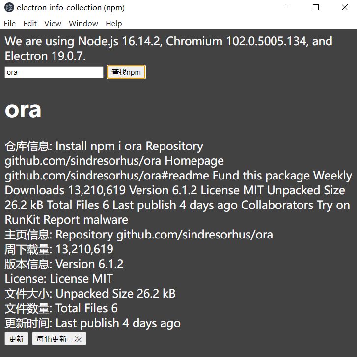

### 通过electron、puppeteer、nightmare、node，用于快速爬取网站、实用、github、npm信息

### 目前支持获取NPM的包信息，支持查询、定时更新、版本信息




### 快速开始

```
 yarn                   //安装依赖
 
 yarn server            //启动node服务

 yarn start             //启动electron

 yarn make              //编译成exe应用程序文件

 yarn package           // 打包electron文件
```